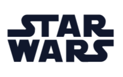

# 🌌 Star Wars Angular App

🔗 **Live Demo:** [yazan-manaldeen.github.io/star-wars/](https://yazan-manaldeen.github.io/star-wars/)

> A simple Angular project that displays Star Wars data using the [SWAPI - The Star Wars API](https://swapi.dev/).  
> This application allows users to explore information about characters, planets, and starships from the Star Wars universe.

---

## 🚀 Features

- Browse Star Wars characters, films and planets
- Fetches live data from [SWAPI](https://swapi.dev/)
- Built with Angular and TypeScript
- Responsive and modern UI
- Easy to extend and customize

---

## 🧰 Requirements

Make sure you have installed:

- [Node.js](https://nodejs.org/) (v18 or later)
- [Angular CLI](https://angular.io/cli) (v17)

---

## ⚙️ Installation & Run

```bash
# Clone the repository
git clone https://github.com/username/star-wars.git

# Enter project folder
cd star-wars

# Install dependencies
npm install

# Run the development server
ng serve
```

Then open your browser and navigate to  
👉 `http://localhost:4200/`

---

## 🧩 Folder Structure

```text
src/
 ├── @core/
 │   ├── animations/
 │   ├── generic/
 │   │   ├── components/
 │   │   │   ├── object-cards/
 │   │   │   └── object-details/
 │   │   └── models/
 │   └── services/
 ├── app/
 │   ├── components/
 │   │   ├── character/
 │   │   │   ├── character-details
 │   │   │   └── characters
 │   │   ├── dialogs/
 │   │   │   ├── add-character
 │   │   │   ├── add-film
 │   │   │   ├── add-planet
 │   │   │   ├── add-specie
 │   │   │   ├── add-starship
 │   │   │   └── add-vehicle
 │   │   ├── films/
 │   │   │   ├── film-details
 │   │   │   └── films
 │   │   ├── home/
 │   │   ├── planets/
 │   │   │   ├── planet-details
 │   │   │   └── planets
 │   │   ├── species/
 │   │   │   ├── specie-details
 │   │   │   └── species
 │   │   ├── starships/
 │   │   │   ├── starship-details
 │   │   │   └── starships
 │   │   └── vehicles/
 │   │       ├── vehicle-details
 │   │       └── vehicles
 │   ├── config/
 │   ├── services/
 │   ├── store/
 │   ├── utils/
 │   └── app.module.ts
 ├── assets/
 │   ├── thumbnails/
 │   │   ├── films/
 │   │   ├── people/
 │   │   ├── plants/
 │   │   ├── species/
 │   │   ├── starships/
 │   │   └── vehicles/
 │   └── app-logo.png
 └── index.html
```

---

## 📦 Build for Production

```bash
ng build
```

---

## 👨‍💻 Developer

**Name:** Yazan Man Aldeen    
**GitHub:** [github.com/yazan-manaldeen](https://github.com/yazan-manaldeen)

---

---

# 🇩🇪 Star Wars Angular App (Deutsch)

🔗 **Live Demo:** [yazan-manaldeen.github.io/star-wars/](https://yazan-manaldeen.github.io/star-wars/)

> Eine einfache Angular-Anwendung, die Star-Wars-Daten über die [SWAPI - The Star Wars API](https://swapi.dev/) anzeigt.  
> Mit dieser App können Benutzer Informationen über Charaktere, Planeten und Raumschiffe aus dem Star-Wars-Universum erkunden.

---

## 🚀 Funktionen

- Durchsuchen von Charakteren, Filmen und Planeten
- Holt Live-Daten von [SWAPI](https://swapi.dev/)
- Erstellt mit Angular und TypeScript
- Responsives und modernes Design
- Einfach zu erweitern und anzupassen

---

## 🧰 Voraussetzungen

Bitte installieren Sie:

- [Node.js](https://nodejs.org/) (Version 18 oder neuer)
- [Angular CLI](https://angular.io/cli) (V17)

---

## ⚙️ Installation & Start

```bash
# Repository klonen
git clone https://github.com/username/star-wars.git

# In den Projektordner wechseln
cd star-wars

# Abhängigkeiten installieren
npm install

# Entwicklungsserver starten
ng serve
```

Dann öffne den Browser und gehe zu  
👉 `http://localhost:4200/`

---

## 🧩 Projektstruktur

```text
src/
 ├── @core/
 │   ├── animations/
 │   ├── generic/
 │   │   ├── components/
 │   │   │   ├── object-cards/
 │   │   │   └── object-details/
 │   │   └── models/
 │   └── services/
 ├── app/
 │   ├── components/
 │   │   ├── character/
 │   │   │   ├── character-details
 │   │   │   └── characters
 │   │   ├── dialogs/
 │   │   │   ├── add-character
 │   │   │   ├── add-film
 │   │   │   ├── add-planet
 │   │   │   ├── add-specie
 │   │   │   ├── add-starship
 │   │   │   └── add-vehicle
 │   │   ├── films/
 │   │   │   ├── film-details
 │   │   │   └── films
 │   │   ├── home/
 │   │   ├── planets/
 │   │   │   ├── planet-details
 │   │   │   └── planets
 │   │   ├── species/
 │   │   │   ├── specie-details
 │   │   │   └── species
 │   │   ├── starships/
 │   │   │   ├── starship-details
 │   │   │   └── starships
 │   │   └── vehicles/
 │   │       ├── vehicle-details
 │   │       └── vehicles
 │   ├── config/
 │   ├── services/
 │   ├── store/
 │   ├── utils/
 │   └── app.module.ts
 ├── assets/
 │   ├── thumbnails/
 │   │   ├── films/
 │   │   ├── people/
 │   │   ├── plants/
 │   │   ├── species/
 │   │   ├── starships/
 │   │   └── vehicles/
 │   └── app-logo.png
 └── index.html
```

---

## 📦 Produktions-Build

```bash
ng build
```

---

## 👨‍💻 Entwickler

**Name:** Yazan Man Aldeen    
**GitHub:** [github.com/yazan-manaldeen](https://github.com/yazan-manaldeen)
